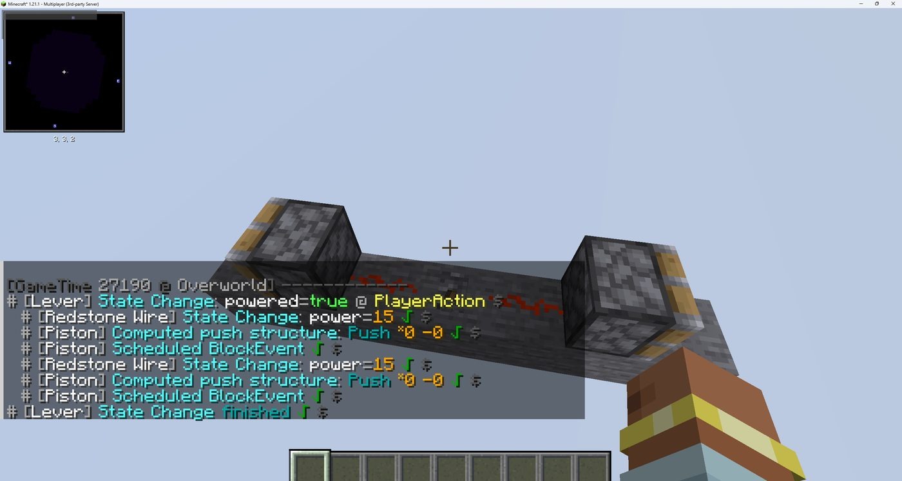
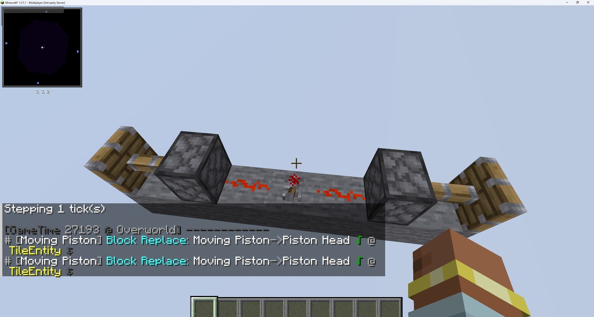
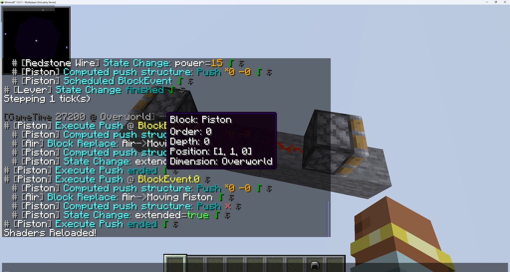

# two-piston-locational — #15 microTiming 突合の記録 (2026-07-03)

対称 2 ピストン回路 (`piston W | dust | lever | dust | piston E`)。NBT は
ユーザ環境の `microtiming-2piston.nbt` と同一構成。

## 状態系列 (レイヤ A) — ✅ 実機一致

fixture `two-piston-locational` を Fabric 1.21.1 + carpet で生成し、
sim と **15 tick 分完全一致** (extend/retract の moving_piston 遷移含む)。

## sim の BE 順予測 (レイヤ C 相当・within-tick 順) — 後段の観測で反証

レバー ON の同 tick の BE キュー投入順 (= ダスト多段送信 HashSet 順由来):

```
1. (5,1,0) piston extend   ← 東 (レバーとの相対位置は対称なのに先)
2. (1,1,0) piston extend   ← 西
```

トレース (08 記法):
```
0gt[PI]: Le{n.0}
0gt[BE]: Pi(p.s) ×2      # 同 tick に両ピストンの BE 予約
1gt[BE]: Pi{p.0} ×2      # BE フェーズで両方伸長 (moving 化)
1gt[ST]: Ph(c.2) ×2
3gt[ST]: Ph{c.2} ×2      # +2gt で head 確定
```

## 実機の within-tick 順 (microTiming) — ✅ 観測完了 (2026-07-03)

Fabric 1.21.1 + carpet + carpet-tis-addition 1.81.0 サーバ (harness の
docker-compose.override.yml で一時構築) に 1.21.1 バニラクライアントで接続し、
`/carpet microTiming true` + `microTimingTarget in_range` + `/log microTiming all`
で観察。`/tick freeze` → レバー ON → `/tick step 1` を tick 送り。

### 観測タイムライン (GameTime は観測時の実値)

| GameTime | フェーズ | イベント |
|---|---|---|
| 27190 | PI (PlayerAction) | `[Lever] powered=true` → `[Wire] power=15` → `[Piston] Scheduled BlockEvent` → `[Wire] power=15` → `[Piston] Scheduled BlockEvent` (ダスト→BE 予約が 2 組、レバー処理内で完結) |
| 27191 | BlockEvent | `Execute Push @ BlockEvent.0` ×2 — **同一 tick 内で FIFO 連続実行**。各実行内で `Air→Moving Piston` 置換 + `extended=true` |
| 27193 | **TileEntity** | `Moving Piston→Piston Head` ×2 — 実行から +2gt で head 確定。トリガーから計 3gt (02 §6 の時系列と一致) |

再取得時 (27199 ON → 27200 Execute ×2) も同一構造。retract 側も
`Moving Piston→Piston` ×2 @ TileEntity を確認 (27198)。




### BE 実行順 (locational の核心) — ❌ sim と不一致

1 個目の `Execute Push @ BlockEvent.0` の `$` ホバーで座標を確認:
**`Position: [1, 1, 0]` (Order: 0) = 西ピストンが先**。



| | 1 番目 | 2 番目 |
|---|---|---|
| 実機 | **西 (1,1,0)** | 東 (5,1,0) |
| sim (上記予測) | 東 (5,1,0) | 西 (1,1,0) |

実機順はレバーの NC 更新順 (W,E,D,U,N,S) と整合する: 西ダストが先に
neighborChanged を受け、そのカスケード (updatePowerStrength → HashSet 送信 →
西ピストン checkIfExtend → blockEvent) が東ダストの更新より先に完結する。

sim 側の原因: `collectAdjacentWires` が `ALL_DIRS` (N,S,**E,W**,U,D) 順で
BFS 起点を集める → `changedWires` の探索順が東ダスト先行 → ダスト多段送信
(BE 投入) が東から始まる。**起点収集を NC 順 (W,E,D,U,N,S) に合わせるのが修正方針**
→ **#46 / PR #47 で修正済み** (`collectAdjacentWires` / `collectWireStarts` を NC 順化、BE 順の単体テストを world.test.ts に追加)。

なお状態系列 (レイヤ A) は両ピストンが同 tick 内に伸びるため、この順序ズレを
検出できない — within-tick 順の実機突合が必要だった理由そのもの。
